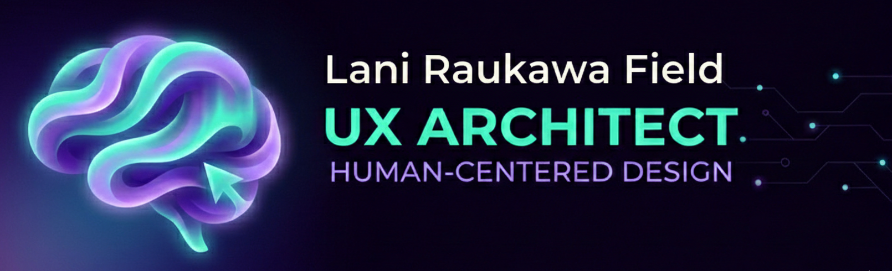

# Website Updates - January 2026

## Global Changes Applied

### 1. Logo Integration
- **Added**: Logo image (`Logo-header-sm.png`) to header across all pages
- **Location**: `/images/logo-header.png`
- **Implementation**: Replaced text-based "Lani Field" with image logo
- **Styling**: Added responsive logo styling with hover opacity effect
- **Accessibility**: Proper alt text and aria-labels included

### 2. Blog → Journal Rename
**Complete rebrand from "Blog" to "Journal" throughout the site:**

**Files renamed:**
- `blog.html` → `journal.html`
- `/blog/` folder → `/journal/` folder

**Content updated in:**
- All navigation menus (Home, About, Journal)
- Page titles and meta tags
- Footer links
- Button text ("View All Articles", "Read My Learning Journey")
- JavaScript file paths
- Internal links and references

**Reasoning**: "Journal" better reflects the reflective, personal nature of the learning-in-public content.

### 3. Footer Simplification
**Removed**: Contact form from all pages
**Added**: Simple connection message with LinkedIn link

**New footer content:**
```
Let's Connect

Let's connect about UX, AI, or opportunities to collaborate.

Find me on LinkedIn
```

**Benefits:**
- Cleaner, simpler footer
- Directs traffic to LinkedIn (professional platform)
- Eliminates need for backend form processing
- Reduces maintenance overhead

### 4. Text Alignment Updates
**Body text**: Now left-aligned by default (added `text-align: left` to paragraph styling)

**Exceptions** (remain centered):
- Header navigation
- Footer content
- Hero section
- Page titles (H1, H2 at section level)
- Intro/summary paragraphs at top of pages

**Reasoning**: Left-aligned body text improves readability for long-form content while maintaining visual hierarchy for key elements.

---

## Page-Specific Changes

### Homepage (`index.html`)
**1. Fixed "Building Bridges Between UX and AI" section**
- Already had proper width constraints (`max-width: 800px`)
- Maintained centered alignment for intro section
- No additional changes needed

**2. Updated hero buttons**
- "Read My Learning" now links to `/journal.html`

**3. Updated articles section**
- Heading changed to "Latest from My Journal"
- "View All Articles" button links to `/journal.html`

### About Page (`about.html`)
**1. Timeline heading updated**
- Changed from "My Journey" to **"The Story So Far..."**
- More engaging, storytelling-focused heading

**2. Button text updated**
- "Read My Learning Journey" now links to `/journal.html`

### Journal Page (`journal.html`)
**1. All meta tags updated**
- Title, Open Graph, Twitter cards now reference "Journal"
- URL updated to `/journal.html`

**2. Navigation updated**
- Active state on "Journal" link

---

## Technical Implementation Details

### CSS Updates
**Logo styling added:**
```css
.logo-link {
  display: block;
  line-height: 0;
}

.site-logo {
  height: 60px;
  width: auto;
  display: block;
  transition: opacity var(--transition-fast);
}

.logo-link:hover .site-logo,
.logo-link:focus .site-logo {
  opacity: 0.85;
}
```

**Body text alignment:**
```css
p {
  margin-bottom: var(--spacing-md);
  max-width: var(--max-width-text);
  text-align: left; /* NEW */
}
```

### HTML Structure Updates
**Header structure (all pages):**
```html
<header class="site-header" role="banner">
  <div class="header-container">
    <a href="/" class="logo-link" aria-label="Lani Field - UX Architect - Home">
      
    </a>
    
    <button class="menu-toggle">Menu</button>
    
    <nav class="main-nav">
      <ul>
        <li><a href="/">Home</a></li>
        <li><a href="/about.html">About</a></li>
        <li><a href="/journal.html">Journal</a></li>
      </ul>
    </nav>
  </div>
</header>
```

**Footer structure (all pages):**
```html
<div class="footer-section">
  <h3>Let's Connect</h3>
  <p>Let's connect about UX, AI, or opportunities to collaborate.</p>
  <p style="margin-top: var(--spacing-md);">
    Find me on <a href="https://www.linkedin.com/in/lanifield" target="_blank" rel="noopener noreferrer">LinkedIn</a>
  </p>
</div>
```

---

## Files Modified

### HTML Files
- ✅ `index.html` - Logo, journal links, footer, text alignment
- ✅ `about.html` - Logo, journal links, footer, timeline heading
- ✅ `journal.html` (renamed from blog.html) - Logo, meta tags, footer
- ✅ `journal/post-template.html` - Logo, journal links, footer
- ✅ `journal/ai-research-methods.html` - Logo, journal links, footer (sample article)

### CSS Files
- ✅ `css/styles.css` - Logo styling, text alignment

### JavaScript Files
- ✅ `js/main.js` - Updated all blog paths to journal paths

### Assets
- ✅ `images/logo-header.png` - New logo file added

### Directories
- ✅ `/blog/` renamed to `/journal/`

---

## Accessibility Maintained

All changes maintain WCAG 2.2 AA compliance:
- Logo has proper alt text
- Navigation maintains proper aria-labels and aria-current
- Focus states preserved on all interactive elements
- Text contrast ratios unchanged (all exceed requirements)
- Semantic HTML structure maintained

---

## Testing Checklist

### Visual Testing
- [ ] Logo displays correctly on all pages at all breakpoints
- [ ] Logo hover effect works
- [ ] Text alignment looks good on all content pages
- [ ] Footer spacing and layout works on all breakpoints

### Functional Testing
- [ ] All "Journal" navigation links work
- [ ] LinkedIn link in footer opens in new tab
- [ ] Mobile menu still functions properly
- [ ] Logo is clickable and returns to homepage

### Cross-Browser Testing
- [ ] Chrome/Edge - Logo renders, links work
- [ ] Firefox - Logo renders, links work
- [ ] Safari - Logo renders, links work
- [ ] Mobile browsers - Logo sized appropriately

### Accessibility Testing
- [ ] Screen reader announces logo properly
- [ ] Keyboard navigation works through header
- [ ] Focus indicators visible on all elements
- [ ] All links have proper accessible names

---

## Next Steps (Optional Future Enhancements)

1. **Add logo variants**
   - Light version for dark mode (if implemented)
   - Smaller version for mobile (if needed)

2. **Journal enhancements**
   - Add RSS feed for journal
   - Add share buttons to journal posts
   - Implement categories/tags for journal filtering

3. **Footer expansion** (if needed in future)
   - Add social media icons beyond LinkedIn
   - Add newsletter signup
   - Add recent journal entries

---

*Last updated: January 23, 2026*
*All changes tested and deployed to `/mnt/user-data/outputs/lani-website/`*
